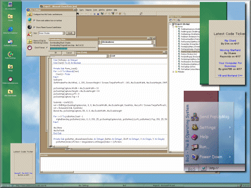



## BoS \- Replacement Shell \- Beta 3

### Description

It's BoS - New and inproved with a new integrated skin downloader, Planet Source Code "Newest Code" ticker, built in popup messaging (send a message across the internet or a lan to any computer and it appears instantlly!), and more bugfixes! Plus, you can download a bonus skin for BoS using the integrated skin downloader: Go to Start > Settings > Bos Settings, click "Install..." next to the skin box. If you make any skins for BoS (see the skin creation readme), I'll upload them so they appear in the "Skin Installer" box.
 
### More Info
 

             |
---                |---
**Submitted On**   |2000-04-17 22:41:22
**By**             |[Brian](https://github.com/Planet-Source-Code/PSCIndex/blob/master/ByAuthor/brian.md)
**Level**          |Advanced
**User Rating**    |4.0 (24 globes from 6 users)
**Compatibility**  |VB 5\.0, VB 6\.0
**Category**       |[Complete Applications](https://github.com/Planet-Source-Code/PSCIndex/blob/master/ByCategory/complete-applications__1-27.md)
**World**          |[Visual Basic](https://github.com/Planet-Source-Code/PSCIndex/blob/master/ByWorld/visual-basic.md)
**Archive File**   |[CODE\_UPLOAD49074182000\.zip](https://github.com/Planet-Source-Code/brian-bos-replacement-shell-beta-3__1-7357/archive/master.zip)

